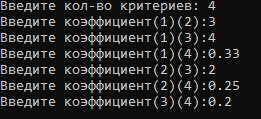

# # MAI
### О программе
программа рассчитывает весовые коэффициенты согласно данным попарного сравнения критериев.
реализация метода ТомасаСаати для одного уровня.
***
### О работе с программой
после запуска программы пользователь вводит кол-во критериев, затем вводит данные попарного сравнения критериев.
после чего программа рассчитывает весовые коэффициенты согласно данным попарного сравнения критериев.
***
### Информация о среде программирования и о запуске кода
среда программирования Visual Studio 2019.
программа скомпилируется в любой среде программирования, поддерживающей c++.
файл в проекте с кодом - 'MAI.cpp'
***
### Пример работы программы (Скриншоты)
 - ввод данных в программу.
***
 - конечный результат расчета весовых коэффициентов.
